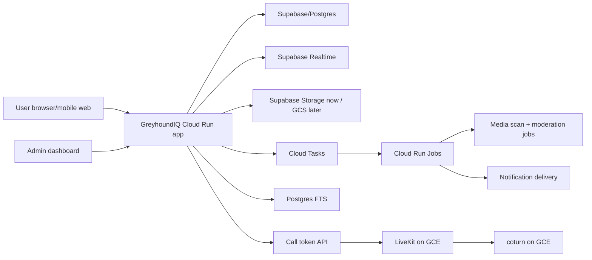

# GreyhoundIQ Marketplace, Community, Messaging, Media, And Calls Plan

Date: 2026-07-03

Scope: extend the Cloud Run migration plan with the native GreyhoundIQ marketplace, community feed, messaging, media, moderation, and later audio/video call architecture. This document does not replace `docs/gcp-cloud-run-migration-plan.md`; it extends it.

## A. Existing Plan Extension

Keep unchanged:

- Main Next.js app/API on Cloud Run with GitHub Actions CI/CD, Artifact Registry, Secret Manager, Cloud Logging/Monitoring, staging-first deploys, and manual production approval.
- Supabase/Postgres remains the initial source of truth.
- Production data safety policy: no seed/reset/db push/destructive migrations, staging/prod credential separation, Cloud Run revision rollback, and forward-fix DB migrations.

Extend with:

- Native marketplace, feed, messaging, moderation, notifications, and media workflows inside GreyhoundIQ.
- Supabase Realtime for MVP message/feed delivery. Add custom WebSocket plus Redis only if load tests prove the need.
- LiveKit self-hosted POC on GCE for audio/video. Cloud Run issues only short-lived call tokens.
- Postgres FTS first. Add Meilisearch only when Postgres search is not enough.
- Admin/moderation queues before marketplace launch.

New risks:

- Dog listings add legal, animal welfare, scam/fraud, platform liability, and privacy review needs.
- Realtime and media paths add abuse, spam, storage-cost, and private attachment exposure risk.
- Audio/video needs UDP/TURN infrastructure, so it is not a good Cloud Run workload.

## B. Framework Decisions

| Area | Recommended now | Avoid for launch | Why |
|---|---|---|---|
| Marketplace | Native GreyhoundIQ | Medusa, Vendure, Saleor | Listings do not need full commerce/order infrastructure yet. |
| Feed/community | Native feed plus current forum | Discourse, Forem, NodeBB, Flarum | External community stacks duplicate identity, theme, data, and ops. |
| Messaging | Current native Postgres messages plus Supabase Realtime | Matrix, Mattermost, Rocket.Chat | Product-native messaging is smaller and keeps WorkOS/profile ownership. |
| Realtime | Supabase Realtime | Custom WebSocket plus Redis | Fits the current stack and keeps MVP ops low. |
| Calls | LiveKit POC on GCE with coturn | Cloud Run media server | WebRTC media needs UDP/public IP/TURN control. |
| Search | Postgres FTS | Meilisearch/Typesense at launch | Keep search simple until latency/relevance says otherwise. |
| Storage | Supabase Storage now, GCS later | MinIO | Existing code already uses Supabase Storage; GCS is lower ops on GCP. |

## C. Recommended Architecture

Core flows:

- Listing: draft or create -> media upload -> pending review -> admin approve -> active -> enquiry/message -> sold/expired.
- Feed: post/comment -> optional media -> spam/keyword checks -> visible or moderation queue -> notifications.
- Message: REST write to Postgres -> Realtime delivery/presence -> receipts persisted -> reports/moderation.
- Call: app verifies participant membership -> creates room/invite -> returns short-lived LiveKit token -> LiveKit handles media.
- Media: signed upload -> pending `MediaAsset` -> scan job -> clean/infected/error -> attach only if clean.
- Moderation: report/flag -> queue -> admin action -> audit log -> notify affected user where appropriate.

## D. Marketplace

MVP:

- Browse listings by type, state/region, price, keyword, and status.
- Create listing with up to 10 images plus 1 video.
- New public listings default to `pending_review`; only moderator-approved listings become `active`.
- Listing enquiry opens or links a conversation.
- Owners can pause/withdraw, mark sold, renew, and edit. Edits to active listings return to review.

Current implementation baseline:

- Existing `Listing` and `ListingMedia` stay in place.
- Existing `MediaAsset` attachment rules stay in place.
- Existing `Report`, `AdminAction`, and `AuditLog` are reused for moderation/audit.

Later schema additions:

- `MarketplaceCategory`, `ListingLocation`, `ListingAttribute`, `ListingStatusHistory`, `SavedListing`, `ListingEnquiry`, `ListingReport`, `ListingModerationAction`, `ListingView`, `ListingSearchIndex`, `UserBlock`, `TrustSafetyFlag`.

## E. Community Feed

MVP:

- Feed page with greyhound-focused posts, topics, comments, reactions, reports, mute/block, and pinned announcements.
- Forum remains available for heavier thread-based discussion.
- Ranking starts transparent: pinned, followed topics/users, recency, and moderation-safe status.

Later schema additions:

- `FeedPost`, `FeedPostMedia`, `FeedComment`, `FeedReaction`, `FeedFollow`, `FeedMention`, `FeedTopic`, `FeedReport`, `FeedModerationAction`, `FeedVisibilityRule`, `PinnedPost`, `Announcement`, optional `CommunityGroup`.

## F. Messaging

MVP:

- Keep `Conversation`, `Message`, `MessageMedia`, and private Supabase Storage attachments.
- Postgres is the source of truth; Realtime is delivery only.
- Client writes through REST/server actions only, then reconnects by paginating REST history.
- Rate limit message send, conversation creation, attachments, reports, and future call invites.

Later schema additions:

- `ConversationParticipant`, `MessageDeliveryReceipt`, `MessageReadReceipt`, `MessageReaction`, `MessageReport`, `MessageModerationAction`, `UserPresence`, `UserBlock`.

## G. Audio/Video

Recommendation:

- Launch MVP excludes public audio/video.
- Build a LiveKit plus coturn POC on a small GCE VM in `australia-southeast1`.
- Cloud Run only verifies access and signs short-lived LiveKit JWTs.
- No public rooms and no recording by default.

Later schema additions:

- `CallRoom`, `CallParticipant`, `CallInvite`, `CallEvent`, `CallReport`, `CallPermission`.

## H. Storage

MVP:

- Keep Supabase buckets: `site-assets`, `public-user-media`, `private-user-media`.
- Public listing/feed media only after scan clean.
- Messages and verification media stay private behind signed URLs.
- Pending uploads expire after 24 hours.

Future GCS:

- `greyhoundiq-prod-media-processing`
- `greyhoundiq-prod-exports`
- `greyhoundiq-prod-backups`
- staging equivalents

## I. Database And Migration

Policy:

- `prisma migrate deploy` only.
- No production seed, reset, db push, destructive SQL, or destructive rollback.
- Production migration requires staging pass, backup timestamp, and manual approval.

Phases:

1. Add nullable fields to existing models.
2. Add new marketplace/feed/moderation/call tables with indexes.
3. Backfill where needed.
4. Add app writes.
5. Enable RLS policies for Supabase Realtime/browser contexts.
6. Tighten `NOT NULL` and constraints later after data is clean.

## J. CI/CD Extension

Add or keep:

- Prisma validation.
- Migration destructive SQL gate.
- Production seed blocker.
- Listing owner/admin/stranger permission tests.
- Message participant/non-participant/block tests.
- Media public/private/scan-pending tests.
- Moderation workflow tests.
- Staging smoke for listing draft, approval, search, enquiry, message, report.
- LiveKit token tests with mocked signing before POC launch.

## K. Admin And Moderation

Required queues:

- Marketplace review queue.
- Listing reports/actions.
- Feed/post/comment reports.
- Message reports limited to reported content.
- Call reports and metadata.
- Media review with scan status.
- User trust/safety flags.
- Category/topic management.
- Banned keywords/phrases.
- Audit logs and admin actions.
- Metrics for pending reviews, report volume, takedowns, repeat offenders, and upload failures.

Permissions:

- `admin`: all moderation/config.
- `moderator`: content review, takedowns, reports.
- `support`: read-only support/report visibility unless elevated.

## L. Legal/Compliance Checklist

Not legal advice. Lawyer/domain expert review required before public marketplace launch:

- Animal sale/listing rules by Australian state/territory.
- Greyhound welfare obligations and prohibited sale language.
- Microchip, identity, registration, and privacy handling.
- Breeder/trainer/transport claims and verification.
- Marketplace liability, scams/fraud disclaimers, and takedown process.
- Australian Consumer Law implications for listings and paid promotion.
- User-generated content terms and moderation rights.
- Private messaging privacy, law-enforcement request process, and retention.
- Audio/video call consent and default recording prohibition.
- Responsible-use wording with no betting, wagering, odds, bookmaker, or gambling positioning.

## M. Roadmap

| Phase | Tasks | Acceptance | Rollback/Risk |
|---|---|---|---|
| 1 | Architecture decision and docs | Decision recorded | No runtime risk |
| 2 | Production data safety gates | CI/workflows block unsafe seed/destructive migrations | Disable gate only with reviewed replacement |
| 3 | Marketplace moderation MVP | Create -> pending review -> approve -> active works | Hide nav/leave pending only |
| 4 | Feed MVP | CRUD plus reports pass | Hide feed nav |
| 5 | Messaging realtime MVP | REST truth plus Realtime smoke pass | Polling fallback |
| 6 | Moderation/admin MVP | Moderator resolves cases | Keep public launch blocked |
| 7 | Storage hardening | Pending media cannot attach in production | Pending-only fallback |
| 8 | Search | Postgres filters/FTS meet p95 | Disable FTS path |
| 9 | Notifications | In-app notifications work | In-app only |
| 10 | LiveKit POC | One-to-one test call works | Disable call button |
| 11 | Staging load test | DB pool stable and alerts fire | Lower concurrency |
| 12 | Production release | Launch checklist green | Cloud Run revision rollback |
| 13 | Post-launch | Abuse, costs, storage, DB, realtime watched | Pause feature writes |

## N. Launch Checklist

- Listing create/edit/pause/sold/expiry tested.
- Listing approval/rejection/removal tested.
- Listing search/filter/pagination tested.
- Dog listing legal/welfare review completed.
- Media upload, scan, private/public URL permission tested.
- Community posts/comments/reactions/reports tested.
- Blocking/muting tested.
- Private messages and non-participant denial tested.
- Supabase Realtime delivery and reconnect tested.
- Call token permissions tested before public calls.
- LiveKit audio/video POC tested before enablement.
- Storage policies and RLS tested.
- Admin queues and audit logs tested.
- Production seed/reset blockers tested.
- Backup and restore drill completed.
- Load test completed for browse/feed/chat/upload/call-token.
- Monitoring, alerts, and budget alerts configured.
- Production secrets verified in Secret Manager only.
- Staging/prod write credential separation verified.
- Rollback tested.
- Public copy verified: not betting, wagering, odds, bookmaker, or gambling infrastructure.

## O. Current Implementation Status

Completed in the current implementation pass:

- Production seed/migration safety gates are in place.
- Marketplace listing creation now starts in `pending_review`.
- Marketplace category, location, history, enquiry, report, moderation action, trust/safety flag, and search-index foundation models are added with additive migrations.
- `/listings` supports category filtering and search-index fallback text matching.
- `/listings/new` captures category, location, condition, contact preference, negotiable status, and dog-listing legal/welfare acknowledgements.
- Listing detail pages support authenticated enquiry-to-conversation and listing reporting.
- Authenticated users can save active listings from the listing detail page and review saved listings under account.
- Listing creation now captures searchable key/value listing attributes and listing details display them.
- Marketplace search now has a forward-only Postgres FTS/trigram migration and the listing browse query uses ranked FTS candidates before falling back to the prior text search path.
- `npm run benchmark:marketplace-search` checks the FTS/trigram indexes and measures marketplace search p50/p95/max latency against the configured database.
- `/admin/listings` provides approve/reject/remove moderation for listings.
- `/admin/listings` also provides marketplace category creation and activation controls.
- Public listing and listing media reads are limited to active, approved, unexpired listings.
- Feed foundations are added with `FeedTopic`, `FeedPost`, `FeedPostMedia`, `FeedComment`, and `FeedReaction`.
- `/feed` supports creating posts, attaching clean public media, commenting, reacting, and reporting feed posts.
- Feed media is authorized through the existing media service and only public for active public feed posts.
- Feed reports reuse the existing `Report` admin queue.
- Feed admin can create/deactivate topics and pin, unpin, hide, remove, or restore posts.
- Banned phrase checks route matched feed posts/comments to hidden moderation state or block submission, based on the configured moderator rule.
- Feed posts support profile-level author blocking through the shared `UserBlock` model, and the feed hides blocked relationships.
- Messaging foundations are added with normalized participants, delivery/read receipts, message reactions, persisted coarse presence, message moderation actions, and profile-level `UserBlock` records.
- Message sends create delivery receipts, read actions create read receipts and participant read cursors, and message reactions are available in the thread UI.
- Supabase Realtime broadcast refresh hints are wired for the public feed, message inboxes, and message threads; private message pages use server-derived opaque channel names and still load message content through authenticated page/REST reads.
- Message threads now publish Supabase Realtime presence on the opaque conversation channel so participants can see when the other participant is online.
- Message threads now support participant-only reporting of received messages, and the admin reports queue shows only the reported message excerpt with audited message moderation actions.
- Message sends now enforce the same banned phrase rules, with review matches creating trust/safety flags and block matches rejecting submission.
- In-app notification foundations are added with notification persistence, account inbox read actions, and triggers for new messages, listing enquiries, feed comments, and feed reactions.
- Notification delivery state is added to persisted notifications, and `/api/internal/notification-delivery` can deliver pending notifications to an optional `NOTIFICATION_WEBHOOK_URL`.
- Cloud Run deploy wiring now creates the `greyhoundiq-{env}-notification-delivery` scheduler job every 5 minutes; when no webhook is configured the route reports pending work and leaves notifications in-app only.
- Profile-level blocks now gate direct messages and LiveKit call room/token creation.
- Call foundations are added with `CallRoom`, `CallParticipant`, `CallInvite`, `CallEvent`, `CallReport`, and `CallPermission`.
- Message threads now expose a private LiveKit call panel for conversation participants with short-lived token issuance, mic/camera toggles, and an end-call API.
- Call token authorization now rejects stale active rooms outside the bounded join window so abandoned active room rows cannot mint fresh LiveKit join tokens indefinitely.
- `/admin/reports` now shows reporter/target context and can resolve or dismiss reports through audited moderator actions.
- Report resolution now creates user warning/ban trust-safety flags, notifies affected users, and sets `User.isBanned=true` for ban actions.
- `/admin/safety` provides banned phrase management, open trust/safety flag resolution, and moderation metrics for pending reviews, reports, takedowns, repeat offenders, upload failures, and open safety flags.
- Internal media maintenance is available at `/api/internal/media-maintenance` for expiring abandoned uploads and optional metadata scanner smoke checks.
- Media maintenance can run `MEDIA_SCAN_MODE=clamav` with `clamscan` to mark pending assets `clean`, `infected`, or `error`.
- Cloud Run deploy wiring now keeps the default web service at `MEDIA_SCAN_MODE=disabled` and deploys `greyhoundiq-media-scanner-{env}` as a private 4Gi scanner service. The PowerShell deploy script points the media maintenance scheduler job at that scanner service with OIDC plus the existing internal secret header.
- The PowerShell and GitHub Actions Cloud Run deploy paths now fail fast for ClamAV scanner deploys unless `greyhoundiq-{env}-SUPABASE_URL` and `greyhoundiq-{env}-SUPABASE_SERVICE_ROLE_KEY` have enabled Secret Manager versions. `npm run check:production-safety` now guards those scanner preflights, LiveKit secret mapping, CI-gated deploy triggering, and the tuned Cloud Run web profile.
- Runtime service accounts now have Secret Manager access only on their own environment-prefixed secrets, keeping staging and prod media/call credentials separated at IAM level.
- Staging Cloud Scheduler now runs listing maintenance, media maintenance, and live data sync through protected internal routes.
- LiveKit infrastructure exists on a GCE Docker host with Caddy and embedded TURN. `livekit.greyhoundsiq.com.au` now resolves to `34.40.149.239`, HTTPS returns `200` through Caddy, `/rtc/validate` returns the expected unauthenticated `401`, and the LiveKit container reports version `1.13.3` with TURN/RTC ports active.

Verified after the latest staging deploy:

- Staging migrations are applied through `20260703184000_add_banned_phrases`; `prisma migrate status` reports the staging database is up to date.
- Staging smoke against `https://greyhoundsiq.com.au` passed after the latest moderation and call deploy.
- Staging smoke still passed after runtime Secret Manager IAM was narrowed.
- Staging marketplace search benchmark passed with p95 `160.0ms` on 13 indexed rows.
- A bounded public endpoint probe returned `200` for `/`, `/races`, `/feed`, `/listings`, and `/api/health/ready`; authenticated chat/upload/call-token load testing remains required.
- `npm run test:staging-load` now runs a bounded no-dependency staging load probe with per-request timeout handling. After the marketplace/feed performance pass and Cloud Run traffic move to tuned revision `greyhoundiq-web-staging-00020-pr9`, public mode passed against `https://greyhoundsiq.com.au` with 12 iterations per endpoint and concurrency 3: ready p50/p95 `424/606ms`, feed health `23/28ms`, browse listings API `24/29ms`, listings page `204/1521ms`, and feed page `330/837ms`. Authenticated probes are skipped until `LOAD_TEST_COOKIE` and target IDs are supplied.
- Watchdog YouTube replay records now render as embedded `youtube-nocookie.com` iframes on race pages. A known staging race page returned `200` and contained the expected YouTube embed after the `00018-f7g` deploy.
- `npm run check:calls` verifies call-token authorization uses active, non-stale room membership with `canJoin=true` and validates the short-lived LiveKit JWT claims with a fake signing secret. The check is part of `npm run ci`.
- `npm run check:marketplace-safety` verifies dog listing welfare/legal acknowledgement enforcement and marketplace media rules: public bucket only, image/video only, max 10 images, and max 1 video. `npm run check:visibility-policies` guards message soft-delete visibility, received-message-only reporting, approved-listing public media, blocked-author feed comment filtering, and no public URL being stored/returned for pending user uploads. Both checks are part of `npm run ci`.
- `npm run test:smoke` now verifies unauthenticated denial for conversations, conversation create, listing create, media upload signing, call room create, and call token routes; live smoke passed against `https://greyhoundsiq.com.au`.
- Notification delivery is intentionally in-app-only for the first release. Staging has no notification webhook secrets configured, and `/api/internal/notification-delivery` returned `200` with `mode=disabled` and no pending work on the public domain.
- Cloud Monitoring has an enabled email notification channel, `/api/health/ready` uptime check, and staging readiness/Cloud Run 5xx alert policies. Billing has a `GreyhoundIQ monthly guardrail` budget.
- Cloud Run rollback drill passed on staging by routing traffic to previous ready revision `greyhoundiq-web-staging-00013-kqz`, smoke-testing, then restoring `greyhoundiq-web-staging-00014-kmz` and smoke-testing again.
- Current launch scheduler paths are bounded; Cloud Tasks/Run Jobs are deferred to archive/backfill workloads rather than marketplace/feed/messaging launch paths.
- Staging schema-only restore drill passed against a disposable local Supabase Postgres 17 database; full Supabase data/PITR restore remains required before production cutover.
- GCS staging/prod media-processing buckets now have 7-day lifecycle cleanup for temporary objects; backups remain retention-policy gated.
- Staging internal scheduler secret was rotated after correcting the media scheduler URI. `greyhoundiq-media-scanner-staging` revision `greyhoundiq-media-scanner-staging-00004-nxg` is serving 100% traffic, and `greyhoundiq-staging-media-maintenance` now targets the private scanner URL with OIDC audience/service account set to the scanner service.
- Secret Manager currently has no enabled versions for staging/prod `SUPABASE_URL` or `SUPABASE_SERVICE_ROLE_KEY`, so real Supabase Storage object scanning is blocked until those values are loaded. Local env inspection found only `.env.selfhost.local` values for these keys, and its Supabase URL is local/self-host, so those values were not copied into staging or prod.

Still required before this plan is complete:

- Load staging `SUPABASE_URL` and `SUPABASE_SERVICE_ROLE_KEY` into Secret Manager, then verify the dedicated ClamAV scanner in staging with real uploaded media, virus definition evidence, and scanner logs/metrics before public media launch.
- Run a real authenticated browser-to-browser audio/video call test after legal/security/cost review.
- Run `npm run test:staging-load` with `LOAD_TEST_COOKIE`, `LOAD_CONVERSATION_ID`, `LOAD_CALL_ROOM_ID`, and `LOAD_INCLUDE_MUTATIONS=true` after staging test accounts and media storage secrets are ready.
- Legal/compliance review completion and launch checklist evidence.
