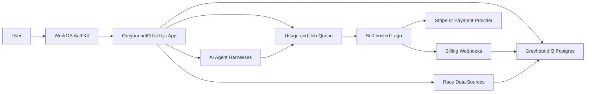

# GreyhoundIQ Production SaaS Layer Plan

> Status: Planning baseline for the next production layer
> Scope: accounts, WorkOS auth flows, organisations, subscription tiers, Lago billing and metering, payment flows, onboarding, admin/support, analytics, security, and Google Cloud VPS operations
> Non-goals: redesigning the existing UI identity, replacing race data providers, or touching source-ingestion contracts during this layer

## Hard Constraints

- WorkOS is the only identity provider. Do not reintroduce Supabase Auth in code, docs, diagrams, or future plans.
- Production runs on AI Kick Start-owned Google Cloud VPS infrastructure for the app, database layer, workers, billing services, and future AI agent harnesses.
- Preserve current race data-source contracts and ingestion paths for Topaz, TheDogs, Watchdog, FastTrack, and archive/import scripts. Account and billing work must wrap access and entitlements around these systems without breaking provider connectivity.
- Lago is included in the target billing layer. Lago owns metering, plans, subscriptions, invoices, entitlements, dunning, and usage-based billing logic. Stripe or another payment service provider collects payments from Lago-managed billing flows.
- The local GreyhoundIQ database remains the app's authorization, entitlement-cache, audit, and operational source of truth. The frontend cannot be trusted for subscription or permission enforcement.
- Supabase may remain as storage or integration where current code uses it, but not as auth and not as the source of user/account truth.
- Keep the current polished GreyhoundIQ design system. Add missing states and flows without changing the visual identity.

## Current State

Confirmed in the codebase:

- WorkOS AuthKit is active through `src/proxy.ts`, `src/app/sign-in/route.ts`, `src/app/callback/route.ts`, and `AuthKitProvider`.
- Local account state exists in Prisma `User` and `Profile`; `syncAuthUser` creates a free user after WorkOS callback.
- `User.subscriptionTier` supports only `free`, `pro`, and `pro_plus`; `stripeCustomerId` and `stripeSubscriptionId` exist but are not wired to a billing system.
- The account page supports profile editing, tier display, data export, and deletion request.
- Pricing is static and CTAs route to contact, not checkout.
- `ProGate`, agent-service tier checks, and media quotas provide partial enforcement.
- Media upload has signed upload intents, quota checks, scan metadata, and audit logs.
- Audit logs and reports exist, but there is no admin dashboard.

Production gaps:

- No plan-aware WorkOS signup handoff, forgot/reset UX, email-verification state, change email/password handoff, account settings split, billing settings, team accounts, organisation roles, or admin UI.
- No Lago, Stripe, checkout, billing portal, invoice, subscription webhook, webhook replay, usage ledger, or entitlement snapshot implementation.
- No active app-level rate limiter.
- No support ticketing, refund workflow, subscription override UI, job-status dashboard, provider health dashboard, or privacy-conscious analytics pipeline.
- Stale docs and copy still mention legacy auth or hosting assumptions instead of WorkOS-only auth and Google Cloud VPS production operations.

## Target Architecture

Ownership:

- WorkOS: identity, sessions, email/password/security lifecycle, organisations where useful.
- GreyhoundIQ DB: local user/account/org records, memberships, roles, entitlements cache, route authorization, usage outbox, audit log, support/admin records.
- Lago: billing customer, billable metrics, plan catalog, subscriptions, usage aggregation, invoices, taxes, dunning, credits, coupons, entitlements.
- Stripe/payment provider: payment methods, payment collection, card compliance, receipts where provider-owned.
- Google Cloud VPS: app runtime, database, workers, Lago services, queue, reverse proxy/TLS, backups, logs, and AI agent harness isolation.

Do not use both Lago and Stripe Billing as competing subscription ledgers. If Lago is included, Lago is the billing source of truth and Stripe is the payment rail.

## Lago Layer

Lago fits GreyhoundIQ because future prediction agents and premium data features are naturally metered. Lago supports usage-based, subscription, and hybrid pricing models; self-hosting; payment-provider integrations; REST APIs; usage ingestion; billable metrics; invoices; entitlements; and dunning.

Recommended deployment:

- Run Lago as a separate service group on the Google Cloud VPS stack or a dedicated billing VM.
- Put Lago behind the internal reverse proxy with restricted admin UI access.
- Store Lago API keys in the server secret store only.
- Use Lago's API for customer creation, subscription assignment, usage event ingestion, and entitlement reads.
- Use Lago webhooks to reconcile local subscription and invoice snapshots.
- Review AGPL obligations before modifying Lago itself. Prefer configuration and API integration over forking.

GreyhoundIQ billable metrics to configure in Lago:

| Metric | Aggregation | Purpose |
|---|---:|---|
| `race_detail_view` | count | Detailed race and runner analysis usage |
| `prediction_run` | count | AI race prediction runs |
| `agent_run` | count | General agent harness executions |
| `agent_tokens` | sum | Cost control for LLM-backed features |
| `api_call` | count | External/API access packages |
| `export_generated` | count | CSV/JSON/PDF exports |
| `media_upload_bytes` | sum | Storage and upload usage |
| `storage_gb_hours` | weighted sum | Storage billing and caps |
| `team_seat` | count unique/latest | Business tier seat billing |
| `priority_job` | count | Priority processing or queue jump usage |

Usage pipeline:

1. App validates user/org entitlement before starting an expensive action.
2. App writes a local `UsageEvent` and `UsageOutbox` row with idempotency key.
3. Worker sends usage to Lago.
4. Lago aggregates usage into metrics and invoices.
5. Lago webhook returns subscription, entitlement, invoice, dunning, and payment status changes.
6. App updates local `Subscription`, `EntitlementSnapshot`, `InvoiceRecord`, and `BillingEvent`.
7. Server-side guards read local entitlements first and fail closed when the snapshot is absent or expired.

## Account System Plan

Required account flows:

- Signup and login through WorkOS hosted UI only.
- Selected-plan persistence from pricing CTA through WorkOS and back into checkout/subscription assignment.
- Logout route/action available from header, account dropdown, and mobile nav.
- Forgot password and password reset routed through WorkOS-managed flows.
- Email verification state stored locally from WorkOS user state or webhooks; unverified users get restricted mutation access.
- Account creation states: new, synced, onboarding, active, blocked, deletion_requested, deleted/anonymised.
- Protected route matrix for public, signed-in, verified, paid-tier, business-member, admin, and internal jobs.
- Session expiry UX for WorkOS expired sessions: redirect with return path and clear message.
- Profile page and account settings split into profile, security, billing, usage, privacy, notifications, and data controls.
- Change email/password handoff to WorkOS with local audit event on completion.
- Delete account flow with confirmation, grace period, cancellation option, storage deletion job, billing cancellation policy, and audit evidence.
- Organisation/team accounts for Business and Enterprise: organisation, membership, roles, invitations, seat counts, owner transfer, member removal, and org deletion.
- Admin access separated from normal user roles and fully audited.
- Demo accounts must be isolated seeded users/orgs, not production customer records.
- Auth errors must use generic copy and never reveal whether an email exists.

Immediate correction:

- Migrate stale `User.supabaseUid` naming to `workosUserId` or `externalSubject` with a forward-only migration and backfill.
- Update docs/copy that mention Supabase Auth.

## Subscription Tier Structure

Starting public prices can stay as current marketing anchors: Free, Pro at about `$12 AUD/mo` or `$99 AUD/yr`, and Pro+ at about `$29 AUD/mo` or `$249 AUD/yr`. Business and Enterprise need final pricing after usage-cost modelling.

| Tier | Target user | Recommended limits |
|---|---|---|
| Free | Curious users, public race fans | Public racecards/results, limited search, limited detailed views, no advanced prediction agent, small export quota, low upload/storage cap |
| Trial | Conversion path | 7-14 days of Pro or Pro+ features, hard usage caps, card optional depending launch strategy, clear expiry banner |
| Pro Individual | Serious punters, breeders, trainers | Full form tools, saved watchlists, moderate prediction runs, exports, 10GB storage, normal queue priority |
| Pro+ | Power users and analysts | Advanced AI prediction agents, richer breeding/statistics tools, API key access, priority jobs, higher export/API limits, 100GB storage |
| Business/Team | Kennels, syndicates, media/operators | Organisation workspace, seats, shared watchlists, team billing, pooled usage, audit log, admin controls, support SLA |
| Enterprise | Data/commercial partners | Custom contract, custom data access, dedicated agent quotas, private deployment options, SSO/org policy, custom retention, premium support |

Enforce per tier:

- Race detail view counts.
- Prediction run counts.
- Agent token/runtime budgets.
- API calls and API keys.
- Export counts and formats.
- Upload count, file size, storage bytes, and retention.
- Team seats.
- Priority queue access.
- Admin-only overrides with reason and audit log.

State handling:

- `trialing`, `active`, `past_due`, `grace_period`, `paused`, `cancel_at_period_end`, `cancelled`, `expired`, `incomplete`, `payment_failed`, `manual_override`, `enterprise_contract`.
- Every state must produce both a backend entitlement result and a UI banner/CTA.

## Payment And Billing Flows

Use Lago for subscription and invoice logic. Use Stripe or another PSP for payment collection through Lago integration.

Required flows:

- Pricing CTA selects plan and interval.
- Signed-out CTA stores intended plan and redirects to WorkOS.
- Callback sync creates local user/org, creates or finds Lago customer, then resumes plan selection.
- Free plan assigns Lago/free subscription without payment.
- Paid plan starts checkout/payment collection and creates a Lago subscription.
- Trial starts with explicit trial dates and entitlement snapshot.
- Upgrade applies immediately where possible and records proration/credit behavior in Lago.
- Downgrade schedules at period end unless the user confirms immediate loss.
- Cancel schedules period-end cancellation by default; immediate cancellation is support/admin only.
- Resume clears scheduled cancellation before period end.
- Payment method update is handled by Lago/payment-provider portal.
- Failed payment enters Lago dunning and local `past_due`/`grace_period` state.
- Invoices, receipts, credit notes, refunds, taxes/GST, coupons, and promo codes are visible from billing settings or provider-hosted pages.
- Expired checkout sessions, duplicate checkout starts, webhook retries, and incomplete payments are idempotent.

Webhook requirements:

- Verify Lago and PSP webhook signatures.
- Store every webhook with provider, event id, event type, payload hash, received time, processed time, status, and retry count.
- Use idempotency keys for customer/subscription/invoice/payment updates.
- Process webhooks asynchronously after minimal validation.
- Build replay tooling for failed webhook events.

## Signup And Onboarding Journey

Recommended journey:

1. User lands on homepage, race page, pricing, or locked feature.
2. CTA carries `plan`, `interval`, `source`, and `returnTo`.
3. WorkOS signup/sign-in completes.
4. Callback sync creates user and default personal organisation.
5. User accepts Terms, Privacy, responsible racing disclaimer, and age gate where required.
6. Onboarding asks for role: viewer, punter, breeder, trainer, kennel/team, analyst.
7. First-value path opens today's racecard or selected feature.
8. User saves a watchlist or runs a first prediction.
9. Usage meter appears after first metered action.
10. Upgrade prompts appear at high-intent moments: locked prediction, limit reached, export/API request, or repeated detailed views.
11. Checkout success returns to the exact feature that triggered upgrade.
12. Returning users land on dashboard/account-aware next action.

Demo mode:

- Seed demo users for Free, Trial, Pro, Pro+, past_due, Business admin, Business member, and internal admin.
- Demo data must be clearly non-production and isolated from provider credentials and real customer records.

## UI/UX Enhancement Plan

Do not redesign the visual identity. Extend existing components and states.

Add:

- Account dropdown with Account, Billing, Usage, Data export, Support, Admin if eligible, and Sign out.
- Billing settings page with plan, renewal date, invoice link, payment method link, cancel/resume, upgrade/downgrade, and state banners.
- Usage page or account tab with counters, reset dates, included allowance, overage policy, and upgrade actions.
- Trial, grace-period, payment-failed, usage-limit, and locked-feature banners.
- Checkout loading, checkout cancelled, checkout success, webhook pending, payment failed, and retry states.
- Empty states for billing history, usage, support tickets, organisation members, and admin search.
- Inline form validation and generic auth/billing errors.
- Confirmation dialogs for cancel subscription, downgrade, delete account, remove member, override plan, refund, and admin actions.
- Upload and agent progress indicators with queue/running/complete/failed/cancelled states.
- Mobile and tablet parity for account dropdown, billing actions, support, and usage views.
- Accessibility checks for focus, keyboard flow, dialog labels, error announcements, and disabled states.

## Backend And Data Model Plan

Forward-only schema additions:

- `User.workosUserId`, deprecating/backfilling `supabaseUid`.
- `Account` or `Organization`: owner, name, type, billing email, workos org id, status.
- `Membership`: user, org, role, status, invited/accepted dates.
- `Role` and `Permission` or enum-backed role policy.
- `Invitation`: email, org, role, token hash, expires, accepted.
- `TermsAcceptance`, `ConsentEvent`, `MarketingPreference`.
- `Plan`, `PlanEntitlement`, `PriceCatalog` local cache from Lago.
- `BillingCustomer`: local org/user to Lago customer and PSP customer mapping.
- `Subscription`: Lago subscription id, plan, status, trial dates, current period, cancel state, grace state, provider metadata.
- `EntitlementSnapshot`: computed server-readable limits and features by org/user.
- `UsageEvent`, `UsageAggregate`, `UsageOutbox`.
- `BillingEvent`, `WebhookEvent`, `InvoiceRecord`, `PaymentRecord`, `RefundRecord`, `CreditNoteRecord`.
- `SupportTicket`, `SupportMessage`, `Feedback`, `BugReport`.
- `AdminAction`, extending `AuditLog` for reason-required overrides.
- `JobRun`, `DataSourceHealth`, `AgentRunUsage`.
- If document/redaction-style uploads become a product feature: `Document`, `FileObject`, `DocumentVersion`, `ProcessingJob`, `ExportArtifact`, `RetentionPolicy`, `DeletionJob`.

Server services:

- `identity-service`: WorkOS user/org sync and local membership reconciliation.
- `billing-service`: Lago customer/subscription actions and entitlement sync.
- `usage-service`: local metering, outbox delivery, idempotency.
- `entitlement-service`: one enforcement API for UI and server routes.
- `admin-service`: user/org/subscription lookup, overrides, support actions.
- `audit-service`: append-only sensitive action logging.
- `rate-limit-service`: IP/user/org/plan endpoint limits.
- `job-service`: provider sync, billing webhook processing, agent jobs, cleanup jobs.

## Race Data Source Protection

Account/billing work must not break:

- Existing env contracts for `TOPAZ_*`, `THEDOGS_*`, `WATCHDOG_*`, and `FASTTRACK_*`.
- Import/backfill scripts and their progress files.
- Live race/result health endpoints.
- Race archive audit/report scripts.
- Current schema tables that provider importers write to.

Add protection:

- Provider smoke tests before deployment.
- Data-source health panel in admin.
- Separate provider job secrets from user-facing app secrets.
- No billing middleware on internal provider ingestion endpoints except scoped internal job auth.
- No metering events emitted before provider fetch succeeds; meter user-facing consumption, not background ingestion.

## Security, Compliance, And Trust

Required:

- WorkOS-only auth, with generic errors and explicit route protection matrix.
- Organisation-scoped authorization checks for every paid, team, support, admin, upload, export, agent, and billing action.
- Server-side entitlement enforcement before expensive race prediction, export, API, upload, and agent execution.
- Rate limits per IP, user, organisation, endpoint, plan, upload, webhook, and agent workload.
- Signed internal job auth instead of one broad shared secret over time.
- Webhook signature verification, idempotency, replay tooling, and alerting.
- Secrets only in Google Cloud/VPS secret environment, never docs/logs/browser.
- PII and sensitive content redaction in logs, analytics, and error reporting.
- Private-by-default storage for originals, previews, exports, and user uploads.
- Storage deletion jobs with retry/evidence for account deletion and retention expiry.
- Backups for app DB, Lago DB, queues, object storage metadata, and config.
- Restore drills before launch.
- Privacy policy, Terms, cookie policy, refund policy, billing terms, AI processing disclosure, responsible racing disclaimer, and subprocessors list.
- Payment compliance through PSP; no raw card handling in GreyhoundIQ.
- Admin actions require reason, audit entry, and least-privilege role.
- Production error monitoring, uptime checks, queue alerts, and billing webhook failure alerts.

Important current risk:

- Upload finalization must not accept a client-provided clean scan state in production. Only a trusted scanner/processor may mark an upload clean.

## Admin And Support Requirements

Build `/admin` for admin users only:

- User lookup by email, WorkOS id, local id.
- Organisation lookup by name, WorkOS org id, Lago customer id.
- Subscription lookup with status, entitlements, invoices, payments, dunning, trial, cancellation.
- Manual plan override with expiry, reason, approver, and audit.
- Refund/credit workflow that links to Lago/PSP records.
- Support ticket inbox and user feedback.
- Bug report capture with browser/app context but no secrets.
- Job status for provider imports, billing webhooks, usage delivery, account deletion, storage deletion, and AI agent runs.
- Data-source health for Topaz, TheDogs, Watchdog, FastTrack, and archives.
- Failed job retry controls.
- Internal audit log viewer with filters.
- System status page for operators and investor demos.

## Analytics And Conversion Tracking

Use privacy-conscious analytics. Never capture raw document content, private messages, provider credentials, full payment data, or unnecessary PII.

Track:

- `pricing.viewed`
- `auth.signup_started`
- `auth.signup_completed`
- `auth.email_verified`
- `auth.signin_completed`
- `onboarding.started`
- `onboarding.completed`
- `trial.started`
- `race_detail.viewed`
- `watchlist.created`
- `prediction.started`
- `prediction.completed`
- `prediction.failed`
- `agent_run.started`
- `agent_run.completed`
- `media.upload_started`
- `media.upload_completed`
- `export.started`
- `export.completed`
- `feature_locked.clicked`
- `usage.limit_reached`
- `checkout.started`
- `checkout.completed`
- `checkout.cancelled`
- `payment.failed`
- `subscription.upgraded`
- `subscription.downgraded`
- `subscription.cancelled`
- `subscription.resumed`
- `trial.expired`
- `billing.viewed`
- `support.ticket_created`
- `admin.override_applied`

Send analytics from server-side events where possible and attach only local user/org ids, tier, plan, source page, and event metadata safe for reporting.

## Priority Roadmap

### Must-have before demo

- Correct public/product docs to WorkOS-only and Google Cloud VPS target.
- Preserve and smoke-test race data-source connections.
- Add plan-aware pricing CTA flow through WorkOS.
- Add account dropdown and billing/usage placeholders with real states, even if payments are test-mode.
- Add local schema for organisation/account, subscription snapshot, entitlement snapshot, usage event/outbox, webhook event, and admin action.
- Add Lago self-host proof-of-concept in non-production.
- Seed Free, Trial, Pro, Pro+, past_due, Business, and Admin demo accounts.
- Admin read-only dashboard for user/org/subscription/job/source health.

### Must-have before production

- Forward-only WorkOS id migration.
- Lago production deployment, backups, monitoring, API key rotation, and access controls.
- Payment provider integration through Lago.
- Verified billing webhooks and idempotent reducers.
- Server-side entitlement enforcement on all paid features.
- Usage metering for prediction runs, agent runs/tokens, API calls, exports, uploads/storage, and detailed views.
- Billing settings page with plan state, invoices, payment method, cancel/resume, upgrade/downgrade.
- Support/refund workflow.
- Rate limiting and abuse prevention.
- Admin override workflow with audit.
- Privacy/Terms/refund/cookie/subprocessor/AI processing updates.
- Google Cloud VPS deployment runbook, rollback plan, backup restore drill, and smoke tests.
- Race source provider regression suite.

### Should-have soon after launch

- Team invitations, seat management, and pooled usage.
- Customer-facing usage analytics and overage warnings.
- Lago alerts/prepaid credits for heavy AI users.
- Advanced admin search and job retry tools.
- Status page automation.
- Marketing/conversion funnel dashboards.
- Customer health scoring and churn signals.

### Enterprise-grade future improvements

- Enterprise contracts and custom Lago plans.
- WorkOS organisation policy/SSO features where needed.
- Dedicated/private model or agent harness for enterprise customers.
- Custom retention and audit exports.
- Data room/investor demo workspace.
- Advanced fraud/abuse detection.
- Separate billing infrastructure VM or managed service boundary.
- Formal penetration test and compliance review.

## Acceptance Criteria

### WorkOS account layer

- Signup, login, logout, forgot/reset, email verification, change email/password handoff, expired session, deletion, and profile settings are WorkOS-compatible and tested.
- No Supabase Auth copy remains in production-facing account/billing docs.
- Local user sync is idempotent, audited, and fails closed when local account creation fails.

### Organisation/team layer

- A user can create or join an organisation.
- Roles are enforced server-side.
- Business billing maps to organisation, not just individual user.
- Seat counts are metered and reflected in Lago.

### Lago billing layer

- Lago customer, plan, subscription, entitlement, usage, invoice, dunning, and webhook flows work in test mode.
- App stores local snapshots and does not call Lago on every request.
- Webhook replay is safe and idempotent.
- Stripe/payment provider is payment rail only, not competing subscription ledger.

### Entitlement enforcement

- Every paid feature has a named entitlement.
- Server routes/actions enforce entitlement before work begins.
- UI gates match backend decisions.
- Locked states and upgrade prompts are shown consistently.

### Usage metering

- Usage events have stable idempotency keys.
- Duplicate events do not double bill.
- Failed Lago delivery retries from outbox.
- Users/admins can see current usage and reset period.

### Billing UI

- Pricing CTAs route to correct WorkOS/Lago/payment flow.
- Account billing shows free, trial, active, past_due, grace, cancel scheduled, cancelled, expired, and manual override states.
- Checkout success/cancel/pending/failure states are visible and recoverable.

### Admin/support

- Admin can look up users, orgs, subscriptions, usage, invoices, jobs, provider health, support tickets, and audit events.
- Manual actions require reason and write audit logs.
- Refund/credit flows link to Lago/payment-provider records.

### Security/compliance

- Rate limits exist on auth-adjacent, public, upload, export, billing, webhook, and agent routes.
- Secrets are not logged or exposed.
- Race provider credentials remain isolated.
- Backups and restore drills pass.
- Privacy, Terms, refund, billing, cookie, responsible racing, and AI processing policies match implementation.

### Race provider safety

- Existing race source env variables and scripts remain compatible.
- Deployment smoke tests verify live race/result/provider health.
- Billing and account middleware does not block internal ingestion.
- User-facing consumption is metered separately from background provider ingestion.

## References

- Lago GitHub: https://github.com/getlago/lago
- Lago introduction: https://getlago.com/docs/guide/introduction/welcome-to-lago
- Stripe billing guidance used for comparison: `build-web-apps:stripe-best-practices`
