# Data-flow and trust-boundary diagrams

Status: **Partially verified**
Evidence date: 2026-07-13
Owner: GreyhoundIQ security lead

Legend: `TB-nn` references `trust-boundaries.md`. Dashed nodes or text marked `Not verified` describe external configuration that was not inspected.

## 1. Public browsing

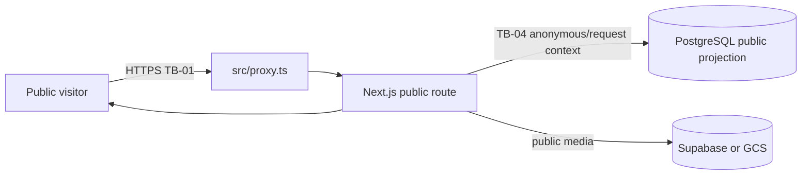

Public cache, CDN/WAF and canonical-host configuration are Not verified.

## 2. Authentication

```mermaid
flowchart LR
  U[User] --> SI[/sign-in]
  SI -->|safe return path| W[WorkOS AuthKit TB-02]
  W -->|code plus state| CB[/callback handleAuth]
  CB --> AS[src/lib/auth-sync.ts]
  AS -->|system context TB-05| DB[(User Profile SocialActor)]
  CB -->|session cookie and internal redirect| U
```

WorkOS tenant MFA, recovery and session settings are Not verified.

## 3. Authenticated application use

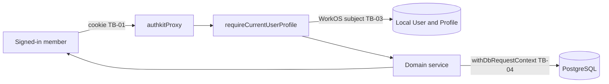

## 4. Administration

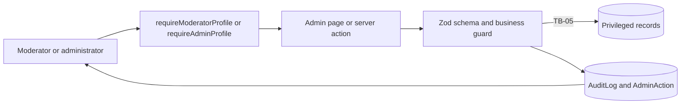

Administrator-only metadata and page guards now protect the identified high-risk read surfaces, with a static regression test. Runtime moderator-negative end-to-end evidence and explicit least-privilege policies for every remaining moderator surface are still missing (`SEC-H-001`); privileged mutation allowlists remain incomplete (`SEC-H-008`).

## 5. Billing

```mermaid
flowchart LR
  U[Member] --> C[POST checkout creation]
  C -->|server price allowlist| ST[Stripe checkout TB-08]
  ST --> U
  ST -->|signed raw webhook| WH[/api/webhooks/stripe]
  WH -->|dedupe and settlement checks| DB[(WebhookEvent User tier)]
  U -->|informational return only| B[Billing page]
  B --> DB
```

The Stripe settlement reducer is focused-test verified; provider tenant configuration is Not verified.

## 6. Racing-data ingestion

```mermaid
flowchart LR
  J[Scheduler or operator] -->|static internal identity TB-12| I[/api/internal/live-sync or CLI]
  I --> P[Racing provider client TB-10]
  P --> V[Parser and normaliser]
  V -->|system context| DB[(Meeting Race Runner Result Raw archive)]
  DB --> C[Public racing pages]
```

Mutating GET and interchangeable static secrets are blocked by `SEC-H-009`.

## 7. Community content

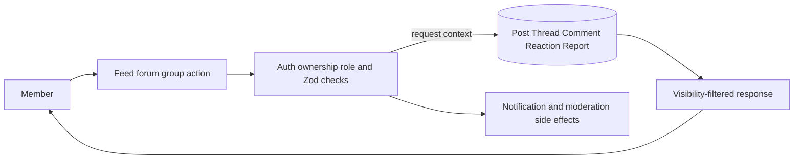

Complete group membership and moderator action traces are Not verified.

## 8. Private messaging

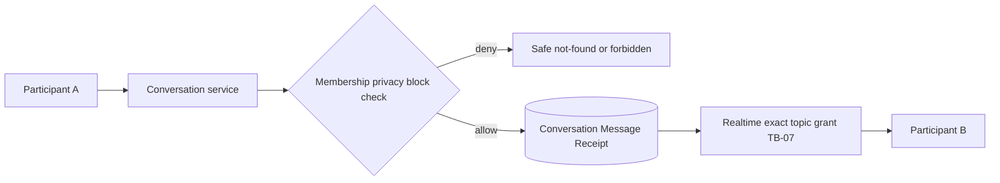

Blocked-conversation grant revocation has focused tests; production RLS deployment is Not verified.

## 9. Voice and video calls

```mermaid
flowchart LR
  U[Conversation participant] --> CS[Call service]
  CS --> M{Conversation membership and block}
  M -->|allow| T[10-minute LiveKit token]
  T --> LK[LiveKit room TB-09]
  LK -->|signed webhook| W[/api/livekit/webhook]
  W --> DB[(CallRoom Participant Event)]
```

## 10. Marketplace

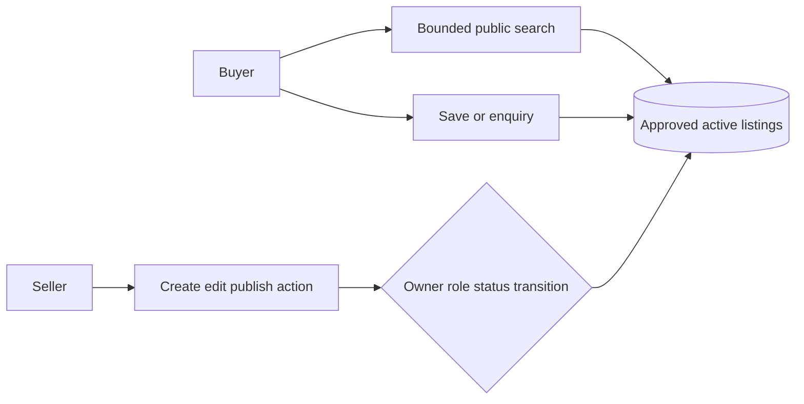

Complete publication, verification and abuse traces are Not verified.

## 11. File uploads and downloads

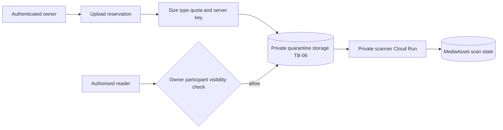

Scanner identity/secrets are over-broad (`SEC-H-004`); live bucket and malware controls were not inspected.

## 12. Data export

```mermaid
flowchart LR
  U[Account owner] --> E[/api/users/me/export]
  E --> A[Same-origin check, auth and fail-closed rate limit]
  A -->|request context and explicit projections| DB[(Bounded user-owned records)]
  DB --> J[Forbidden-key assertion and 8 MiB JSON cap]
  J --> U
  E --> AU[(ExportArtifact and AuditLog)]
```

Every collection is capped at 500, nested media at 20, sensitive provider/storage/raw-agent fields are excluded, and the response is private `no-store` with a safe `413` overflow path. The focused policy test, all 108 source unit tests, typecheck, lint and build pass. `SEC-H-003` remains release-blocking pending runtime cross-user/large-account tests, a managed background-export path for larger accounts and review of creating `ExportArtifact` through GET.

## 13. Account deletion

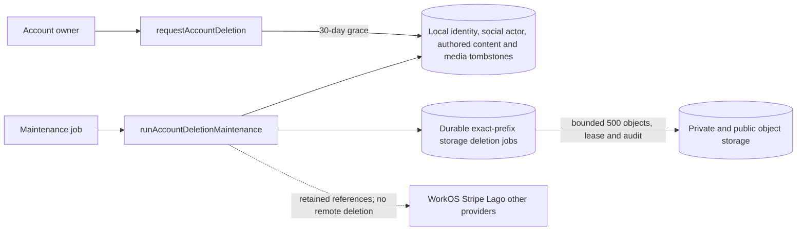

Focused tests plus the 108-test source suite prove sender-only message tombstoning and the bounded storage-job contract. Live storage deletion, provider cancellation/deletion, provider session revocation, managed-page last-owner transfer and backup lifecycle are not verified; `SEC-H-002` remains release-blocking.

## 14. AI tools

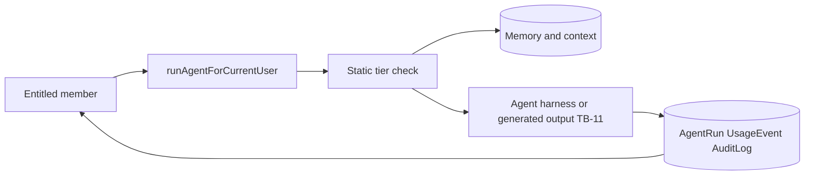

Snapshot/consumption/cost enforcement and runtime isolation are blocked by `SEC-H-007` and `SEC-H-012`.

## 15. Design Lab

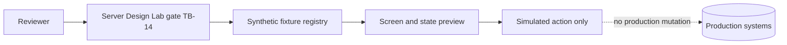

`requireDesignLabReviewer` is called by all six Design Lab routes: local access is allowed, production app access requires the exact flag plus administrator, and explicitly isolated full-access demo mode is synthetic/public by design. Focused noindex/read-only/policy/route/isolation tests pass. Complete runtime route/action data-isolation proof remains Partially verified.

## 16. CI/CD and deployment

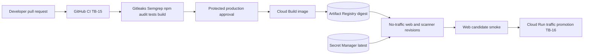

Scanner smoke, least-privilege identities, secret-version pinning, SBOM/signing/provenance, migration/backup binding and automatic rollback remain blocked by `SEC-H-004` and `SEC-H-005`.
